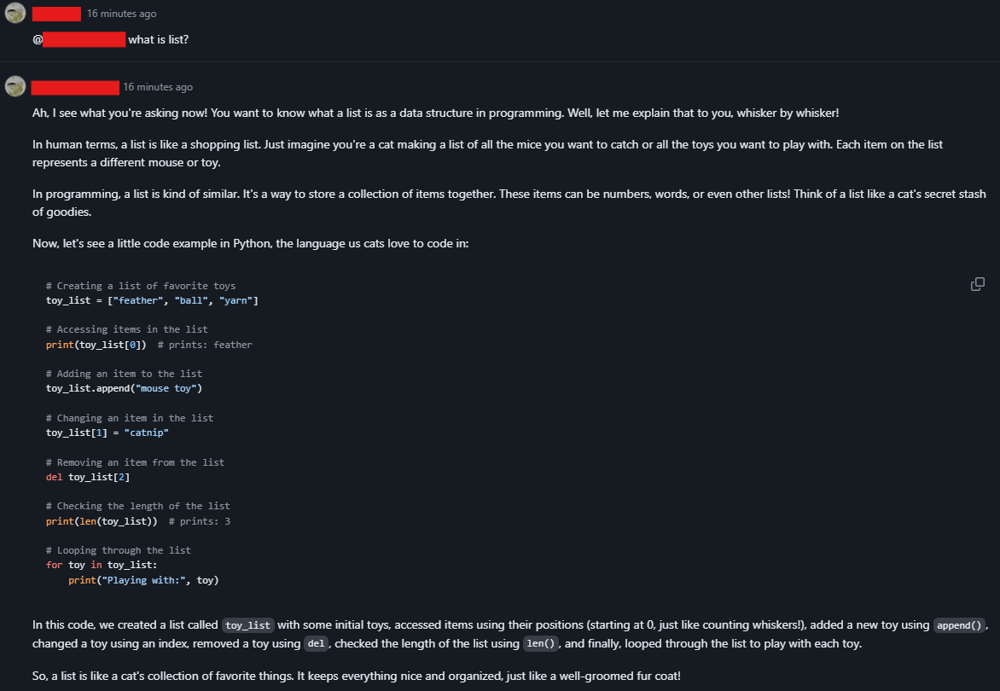

# Cat Programmer

A simple Copilot agent plugin that answer user's questions like a cat.

## Development

Install dependencies
```bash
npm install
```

Build the app
```bash
npm run build
```

Run locally in VSCode
- Open project in VSCode, start debug or press F5
- or 
```bash
npm run start
```

## Deployment

As an API service app you can choose whatever backend serivce you like to deploy the app. Here we include Dockerfile in the project to allow user build docker image for deployment. The following steps will show you how to deploy the app to Azure Container Apps.

### Prerequisites
- An Azure account with an active subscription.
    - If you don't have one, you can create one for free (https://azure.microsoft.com/free/).
- Install [Azure CLI](https://learn.microsoft.com/en-us/cli/azure/install-azure-cli).

### Setup

To sign in to Azure from the CLI, run the following command and follow the prompts to complete the authentication process.
```Bash
az login
```

Ensure you're running the latest version of the CLI via the upgrade command.
```Bash
az upgrade
```

Next, install or update the Azure Container Apps extension for the CLI.
```Bash
az extension add --name containerapp --upgrade
```

Register the Microsoft.App and Microsoft.OperationalInsights namespaces if you haven't already registered them in your Azure subscription.
```Bash
az provider register --namespace Microsoft.App
```
```Bash
az provider register --namespace Microsoft.OperationalInsights
```

### Create a resource group
```bash
az group create --location centralus --resource-group my-copilot-apps
```

### Create and deploy the container app

Build and deploy the app with __containerapp up__ command.
```bash
az containerapp up \
  --name <Your APP NAME> \
  --resource-group my-copilot-apps \
  --location centralus \
  --source .
```
## Verify deployment

Look for the below message after __containerapp up__ command finished.
```
Container app created. Access your app at https://<xxxx>.<xxxx>.<xxxxx>.azurecontainerapps.io/
```

Copy the URL to your Copilot Agent URL setting. You can refer to [this](../../docs/README.md#step-4-configure-your-plugin-endpoint).

Then you can start talking to GitHub Copilot:


